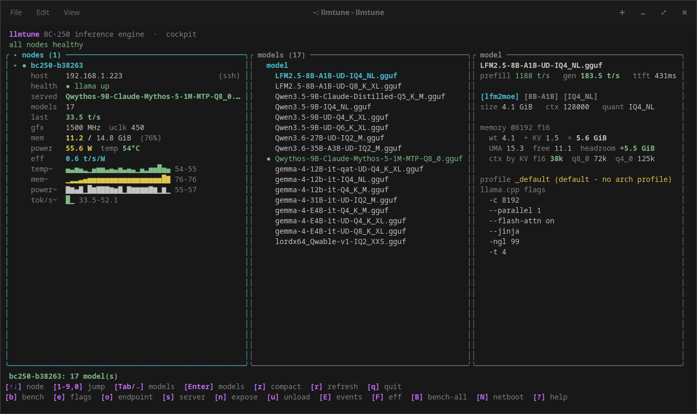

# llmtune

Run LLMs on the AMD BC-250: a single-board inference engine and a fleet
control plane.



The BC-250 is a cheap 16 GiB APU board (Cyan Skillfish, gfx1013) that runs
llama.cpp well once you know the right flags for each model architecture.
llmtune ships that knowledge as data. It discovers your GGUF files, launches
`llama-server` with a known-good per-architecture profile, hot-swaps models
with auto-revert, benchmarks them, and serves an OpenAI-compatible endpoint.
It orchestrates llama.cpp; it does not reimplement inference.

It runs in two shapes:

* One box: llmtune on the BC-250 itself. No config file needed.
* Fleet: llmtune on a control host that PXE-boots a rack of diskless
  BC-250s. Models live in one NFS library and the same TUI/CLI drives
  every node.

Hardware tuning for the board (BIOS settings, memory timings, clocks) lives
in [arieltune](https://github.com/cachenetics/project-ariel).

## Requirements

* An AMD BC-250, or any Linux host that can build and run Vulkan llama.cpp
* `amdgpu` with a Vulkan loader/ICD, and systemd
* A C++/CMake toolchain with `glslc` to build llama.cpp
  (`llmtune doctor` checks all of this and prints install commands)
* Rust (stable) to build llmtune itself

### Build prerequisites (Vulkan llama.cpp)

`llmtune build install vulkan` compiles llama.cpp, which needs a C++ toolchain,
CMake, git, the Vulkan headers + ICD loader, the SPIR-V headers, and a shader
compiler. Install them in one line for your distro:

```sh
# Arch / CachyOS / EndeavourOS / Manjaro
sudo pacman -S --needed base-devel cmake git vulkan-headers vulkan-icd-loader spirv-headers shaderc

# Debian / Ubuntu / Pop!_OS
sudo apt install build-essential cmake git libvulkan-dev glslc spirv-headers

# Fedora / RHEL
sudo dnf install gcc-c++ cmake git vulkan-headers vulkan-loader-devel glslc spirv-headers
```

You do not have to memorize this: `llmtune build install vulkan` (and `llmtune
doctor`) preflight the toolchain and, if anything is missing, fail in seconds
naming the exact packages and the install command above, rather than partway
through a long compile.

## Install

```sh
git clone https://github.com/cachenetics/llmtune
cd llmtune
./install.sh    # cargo build --release, installs to /usr/local/bin
```

`./install.sh --setup` also runs first-run setup (models dir + systemd
service); `--check` runs the preflight afterward. `make install` does the
same install without the extras. `PREFIX` and `DESTDIR` are honored. To try
it without installing: `cargo build --release && ./target/release/llmtune doctor`.

## Quick start

```sh
llmtune doctor                 # preflight: GPU stack, toolchain, models dir
llmtune setup                  # once: models dir + systemd service
llmtune build install vulkan   # once: a pinned llama.cpp build
llmtune models add https://example.com/Qwen3-8B-Q4_K_M.gguf
llmtune node load qwen         # serve it (substring match, auto-revert)
llmtune                        # the TUI
```

Models live in `/var/lib/llmtune/models`; drop `.gguf` files there directly
or use `llmtune models add`. Run llmtune as your normal user, it uses sudo
only for the systemd steps.

## CLI

```sh
llmtune node list            # discovered models (* = currently served)
llmtune node load <name>     # hot-swap the served model
llmtune node bench           # throughput + GPU telemetry, logged to history
llmtune node status          # one-line node status
llmtune endpoint             # the OpenAI-compatible URL + snippets
llmtune endpoint auth on     # generate and apply an API key
llmtune endpoint expose on   # bind to the LAN (turn auth on first)
llmtune build list           # installed llama.cpp builds
```

Every read takes `--json`, destructive actions take `--yes`, `--apply`, or
`--force`, and guard refusals exit 2 (plain errors exit 1), so it scripts
cleanly. The full non-interactive fleet recipe is
[docs/agentic-bringup.md](docs/agentic-bringup.md).

## Fleet mode

Point llmtune at a rack. It stands up a proxyDHCP/NFS/HTTP boot server,
builds a diskless image, netboots each board, and registers them as SSH
nodes in `~/.config/llmtune/fleet.toml`:

```sh
llmtune netboot init --apply         # dnsmasq + NFS export + boot server
llmtune netboot image build --apply  # build the diskless image
llmtune netboot up                   # start the boot stack
llmtune netboot boot <node>          # cold-cycle a board into iPXE
llmtune netboot nodes --register     # booted boards -> fleet.toml
llmtune fleet status                 # then drive the rack
llmtune fleet bench-all
```

`llmtune cluster` pools boards over llama.cpp RPC to serve one model too
big for a single 16 GiB box.

Everything binds loopback by default; exposing the endpoint to the LAN
requires an explicit `endpoint expose on` and warns if keyless. The NFS
export is read-only and scoped to the fleet subnet: keep that CIDR narrow,
every host inside it can read the image and the models.

## License

GPL-2.0-only. See [LICENSE](LICENSE) and [NOTICE](NOTICE). A linking
exception covers the TLS libraries used for network transport; see
[COPYING.LINKING-EXCEPTION](COPYING.LINKING-EXCEPTION).

The names llmtune, arieltune, and Cachenetics are trademarks; the license
conveys no rights to them, so forks must use a different name.
